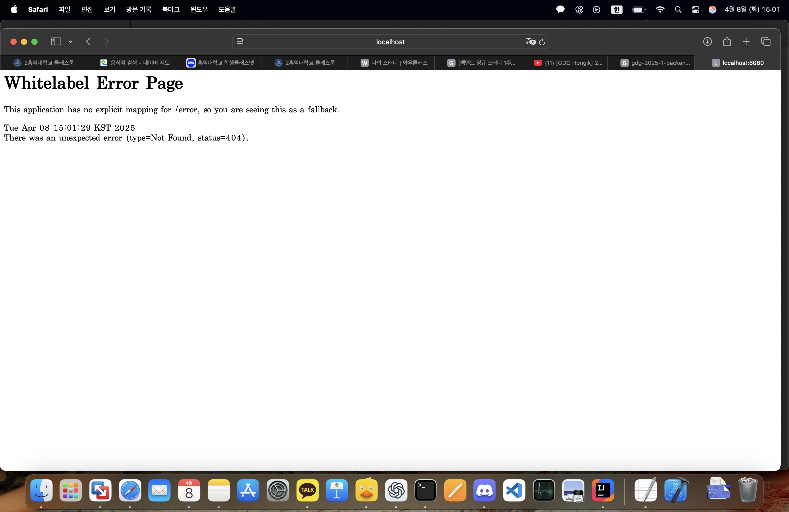

# 백엔드 정규 스터디 1주차 요약

## 소개

- 발표자: 권 (컴퓨터공학과 4학년)
- 역할: 백엔드 파트 리드 / 와클래스 백엔드 개발 담당
- 목적: 얕고 넓게 백엔드의 전체적인 그림을 이해하고, 스프링 프레임워크의 감을 잡는 것이 목표

## 스터디 구조

- 총 6주 과정
  1~2주차: 백엔드 개요 + Spring 핵심 개념
  3~6주차: 실제 서비스(API 서버) 클론 코딩 – 투두메이트 API 프로젝트

## 1주차 학습 주제

### 1. 웹과 HTTP
- 웹은 여러 컴퓨터가 연결되어 정보를 공유하는 공간이다.
- 가장 많이 쓰는 통신 모델은 클라이언트-서버 패러다임이다.

### 2. 클라이언트-서버 패러다임

클라이언트: 요청(Request)을 보내는 주체  
서버: 요청을 처리하고 응답(Response)을 보내는 주체  
※ 역할은 상대적인 개념이다.

예: 브라우저에서 네이버 접속 시  
클라이언트는 브라우저, 서버는 네이버의 서버  
브라우저가 HTML 요청 → 서버는 응답 전송 → 브라우저가 화면 렌더링

## HTTP와 프로토콜

- 프로토콜은 컴퓨터 간 통신을 위한 규칙이다.
- 웹에서는 HTTP 프로토콜을 사용한다.

### HTTP 요청 형식

요청에는 두 가지 요소가 필요하다:  
1. HTTP 메서드 (동사 역할)  
2. URL (데이터 위치)

## 주요 HTTP 메서드

GET: 데이터 조회  
POST: 데이터 생성 (중복 허용)  
PUT: 데이터 전체 수정 또는 생성 (중복 없음)  
PATCH: 데이터 부분 수정  
DELETE: 데이터 삭제  

※ POST는 계속 추가, PUT은 완전 교체, PATCH는 일부 수정

## URL 구성

예시: http://example.com/users/1/nickname  
- 도메인: example.com (서버 주소)  
- 경로: /users/1/nickname (리소스 위치)

### URL 일반화 방법

Path Parameter: /users/{id} 처럼 변수화 가능  
Query String: ?page=1&keyword=hello 처럼 조건을 붙임

## 데이터 전송 내용

- URL은 편지 봉투의 주소처럼 쓰인다.  
- 본문 내용(Content)도 함께 있어야 하며, JSON 등 형식으로 주고받는다.

## API 명세 예시 (todomate)

- 할 일 전체 조회 → GET /todos  
- 할 일 상세 조회 → GET /todos/{id}  
- 할 일 생성 → POST /todos  
- 할 일 전체 수정 → PUT /todos/{id}  
- 할 일 부분 수정 → PATCH /todos/{id}  
- 할 일 삭제 → DELETE /todos/{id}

