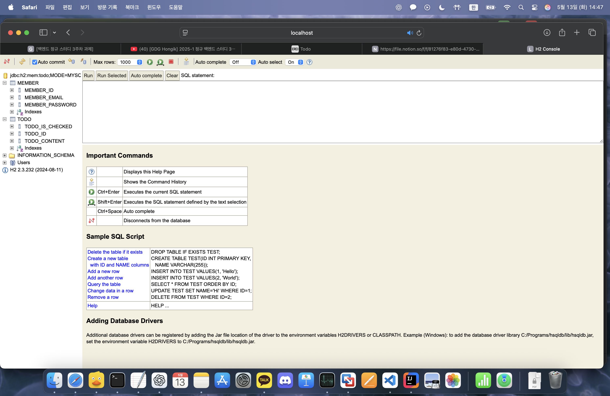

# Week 3 - WIL (What I Learned)

## 학습 주제
- JPA 개념 이해
- ERD 설계 및 엔티티 클래스 작성
- H2 DB를 활용한 테이블 생성 실습

## 핵심 내용 정리
- JPA는 자바 ORM 기술로, SQL 없이 객체를 통해 DB를 조작할 수 있음
- 주요 어노테이션: @Entity, @Id, @GeneratedValue, @Column 등
- ERD를 기반으로 Member, Todo,엔티티 생성
- H2 콘솔에서 테이블 생성 확인

## 느낀 점
- JPA를 통해 SQL 작성 없이 DB를 다루는 방식에 익숙해졌고,
  직접 ERD 기반 테이블을 구현해보며 이해가 깊어짐

