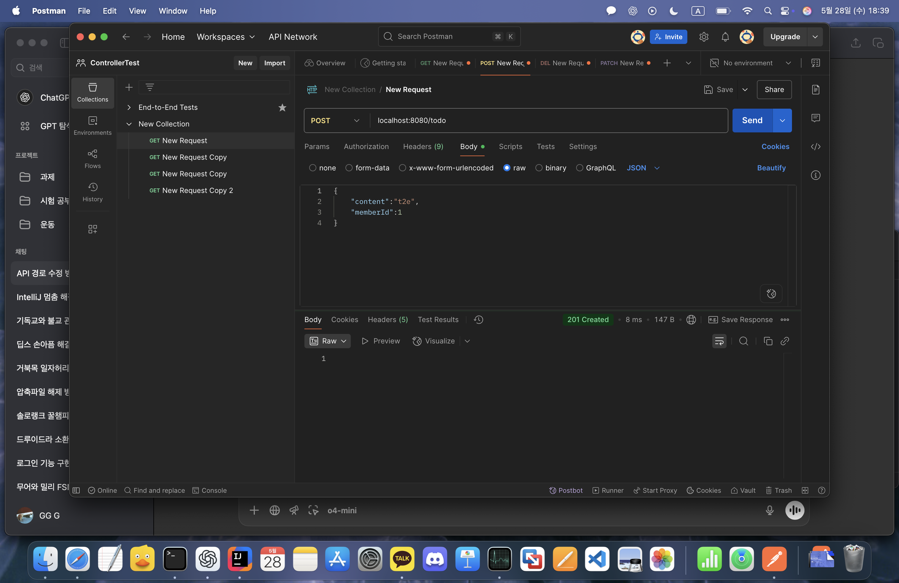
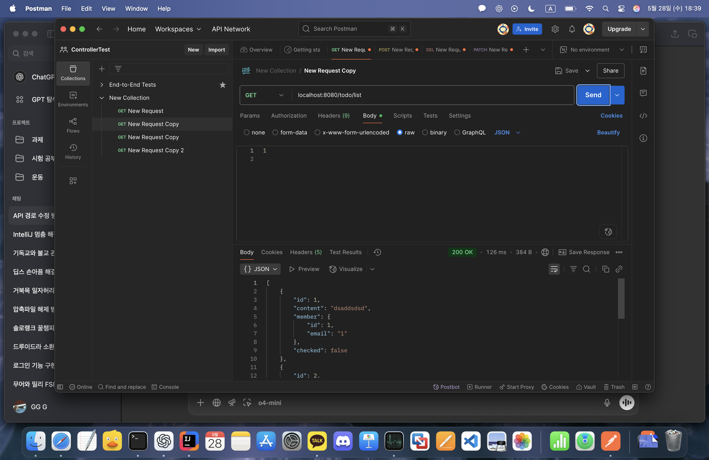
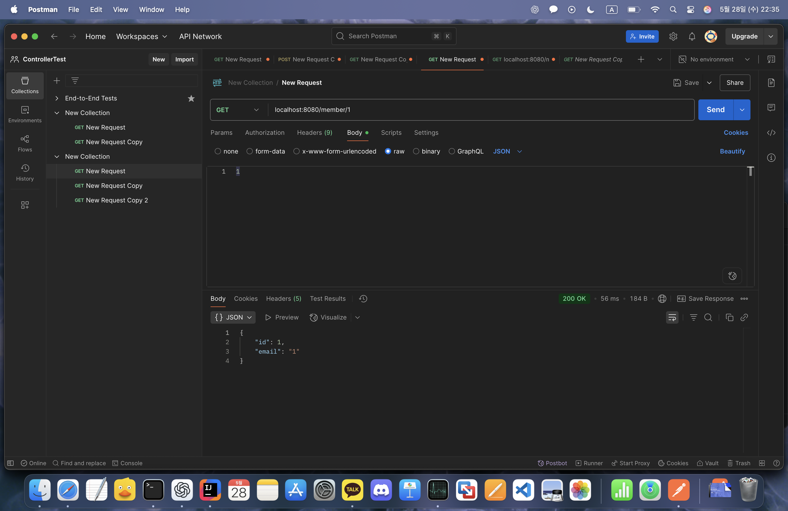

# Week 4 - Repository 계층과 JPA CRUD

## 이번 주 학습 키워드
- Repository 계층
- EntityManager
- JPA CRUD (Create, Read, Update, Delete)
- 영속성 컨텍스트
- 트랜잭션 (@Transactional)
- JPQL
- 테스트 코드와 @Rollback

## 배운 점
- Repository는 데이터베이스와 직접적으로 연결되는 계층으로, 데이터를 저장하고 관리한다.
- `EntityManager`는 JPA에서 핵심 역할을 하며, `persist()`, `find()`, `remove()` 같은 메서드로 CRUD를 수행한다.
- 영속성 컨텍스트는 동일 트랜잭션 내에서 엔티티의 ID가 같다면 같은 객체로 관리하여 중복 조회를 줄인다.
- `@Transactional`은 메서드 단위의 트랜잭션을 보장하며, commit 시점에 변경이 반영된다.
- JPQL을 사용하면 SQL과 유사하지만 객체 중심의 쿼리를 작성할 수 있다.
- 테스트 코드에서는 `@Rollback(false)`를 통해 실제 DB 반영 결과를 확인할 수 있다.

## 느낀 점
기존에는 SQL로 직접 쿼리를 작성하며 DB 작업을 해왔다면, 이번 주차를 통해 객체 중심으로 데이터를 다룰 수 있는 방식에 익숙해졌다. `EntityManager`를 활용하면서 데이터 변경 흐름이 눈에 보이기 시작했고, 특히 영속성 컨텍스트의 작동 원리를 실습으로 체감할 수 있었다

